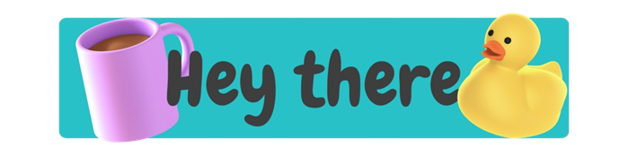
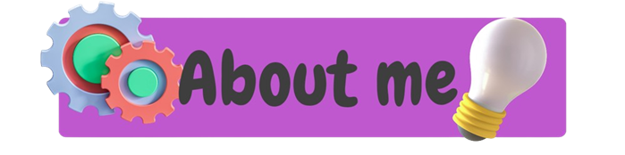
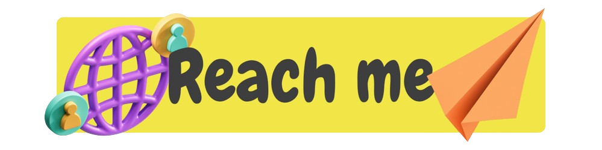

  
  
I'm Evan, a french developer currently in apprenticeship. 😁
 

  
  
Born in 2002, I like learning new concepts and architectures in OOP, exploring modern/trending notions, and others ! 🤩
 

  
  

    
• Currently working on few little <a href="https://react.dev" target="_blank">React</a> projects in Typescript with <a href="https://nextjs.org" target="_blank">Next.js</a>. 😎

    
• And will soon be working on <a href="https://developer.android.com" target="_blank">Android</a> mobile apps.. 😉

  

  
  

    
<a href="https://discord.com/invite/bGJ32uMB">Discord</a>

    
<a href="https://medium.com/@evanguyot.pro">Medium</a>

    
<a href="mailto:evanguyot.pro@gmail.com">E-mail</a>

  

